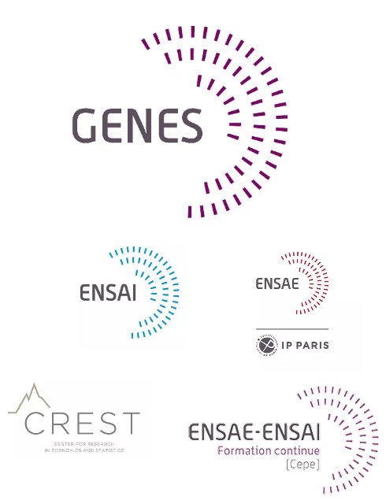
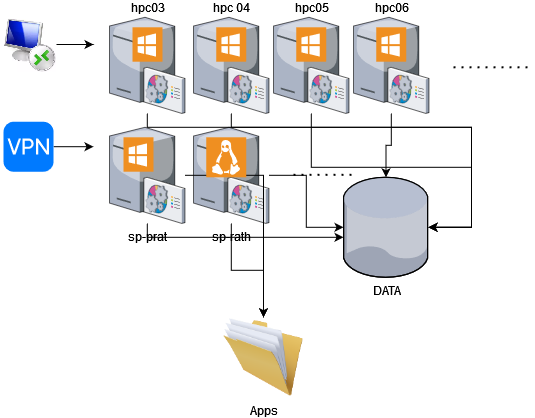
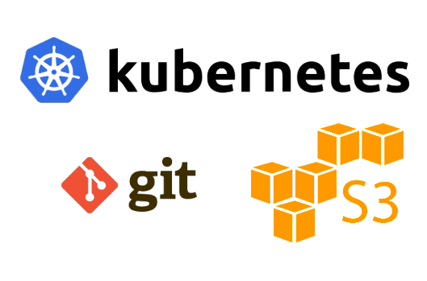
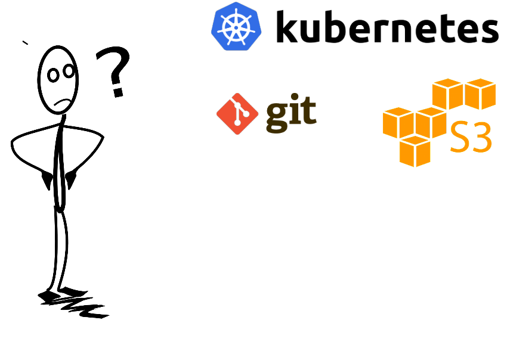
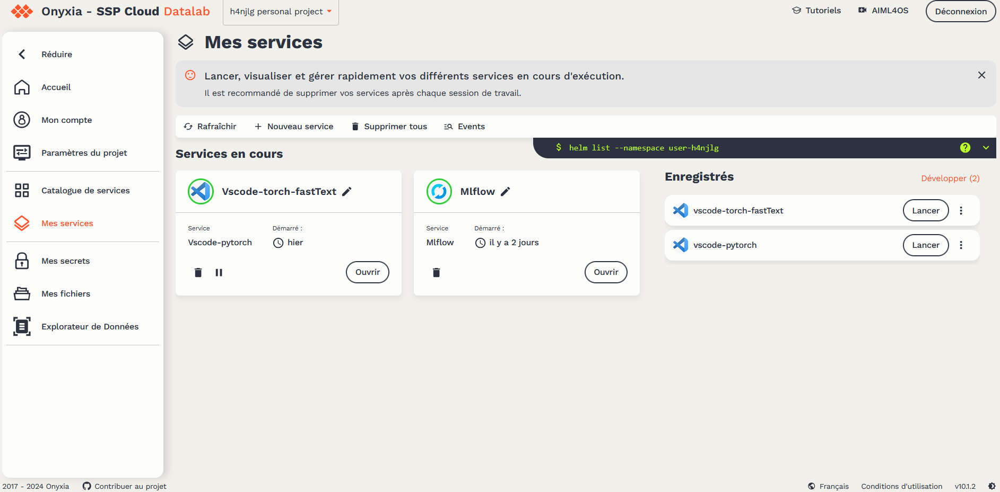
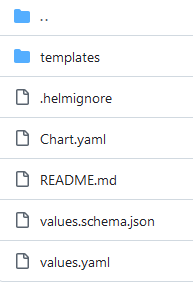
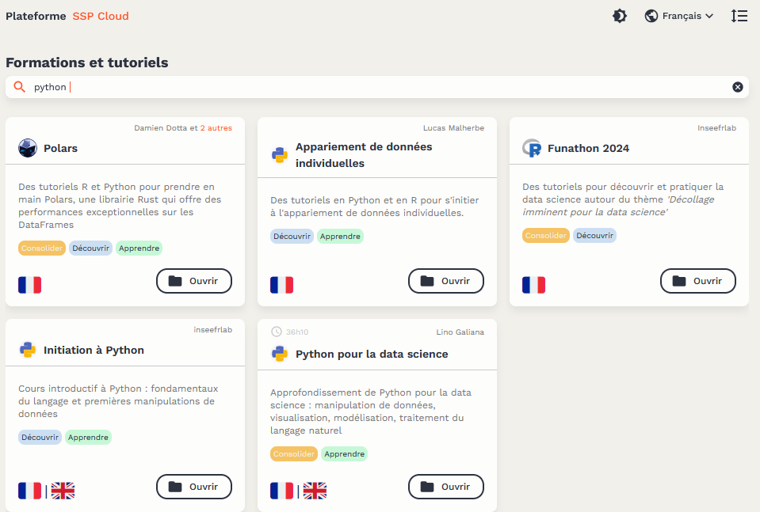
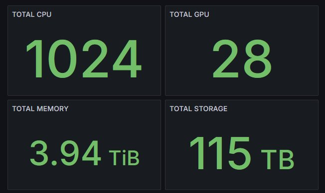
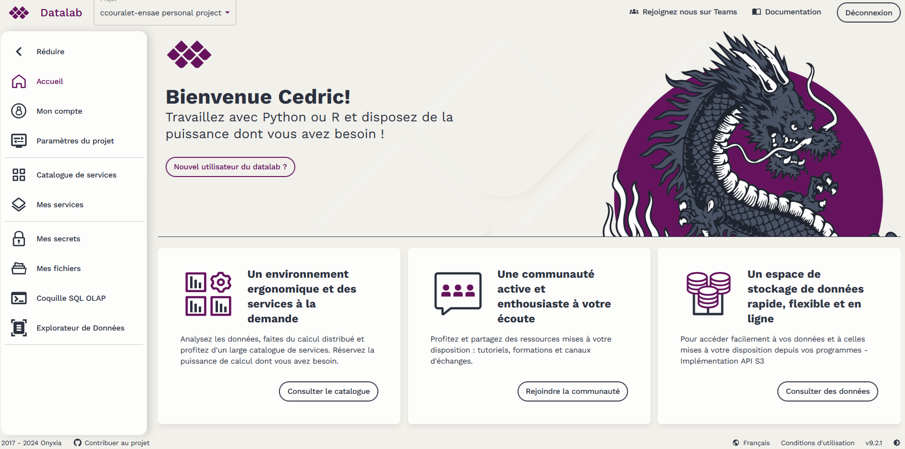
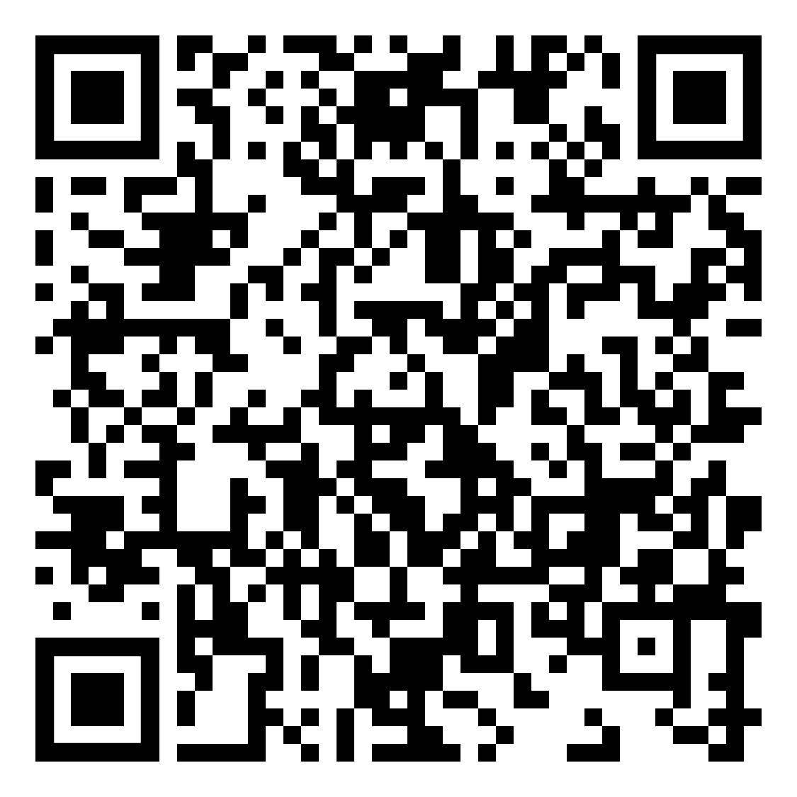

# Modernisation de l'offre scientifique du GENES

## Le GENES

::: columns

:::: {.column width=60%}

- Groupe des écoles nationales d'économie et statistique

- 2 écoles d’ingénieurs, un centre de formation continue, un centre de recherche (UMR)

- Tutelle Technique: Insee.

- Domaines :  Statistique, économie, sociologie…

- **Fort penchant vers la science de la données**

::::

:::: column

{ height=50% }

::::

:::

## Offre scientifique historique

::: columns

:::: column

- Serveurs publics/privés

- Baie de stockage

- Logiciels déployés sur partage réseau

::::

:::: column

{height=40%}

::::

:::

###

😡 Allocation/partage des ressources

😡 Gestion des packages (r, python...)

😡 Gestion des mise à jour (serveur/application)

😑 Performances

😑 ...« je veux faire du LLM »

😑 Reproductibilité / Science Ouverte

## Nouvelle solution

::: {.block}
###

- Moins couteuse pour l'exploitation (uniformisation)
- Proposant une meilleure allocation des ressources et leur partage
- Favorisant la reproductibilité
- Favorisant les bonnes pratiques de séparation code/data/traitement
:::


## Nouvelle solution

::: {.block}
###

- Moins couteuse pour l'exploitation (uniformisation)
- Proposant une meilleure allocation des ressources et leur partage
- Favorisant la reproductibilité
- Favorisant les bonnes pratiques de séparation code/data/traitement
:::

➡️ 

{height=50%}

## Mais

::: {.block}
###
**Comment embarquer les utilisateurs ?**
:::

{height=50%}

# La plateforme Onyxia

## Onyxia

{height=20%} 

**Un cloud opensource pour la datascience** (By Insee)

###

- Pas d'enfermement dans une solution
- Cloud Native
- 100% Open Source (MIT)
- Déploiement facile 


## Onyxia, c'est quoi ?

- Une application web permettant le déploiement de service sur un cluster kubernetes
- Un catalogue de services spécialement construit pour l'intégration de services externes (Stockage Objet, Gestion de secrets, Git...)
- Un catalogue de formation

{height=50%}


## Les grandes fonctionnalités

```{=latex}
\embedvideo{\includegraphics[page=1,height=0.8\textheight]{img/interface-onyxia.png}}{img/demo-onyxia.mp4}
```
[Lien vers la vidéo](https://github.com/micedre/jres2024-slides-onyxia/blob/main/img/demo-onyxia.mp4)


## Fonctionnement: configuration des services

* Utilisation de helm pour le lancement des services
* Utilisation du `values.schema.json` pour l'affichage du formulaire

```json
"accessKeyId": {
  "description": "AWS Access Key",
  "type": "string",
  "x-onyxia": {
    "overwriteDefaultWith": "{{s3.AWS_ACCESS_KEY_ID}}"
  }
}
```

## Fonctionnement: catalogue personnalisé

* Je veux fournir un service personnalisé à mes utilisateurs
    * Package en chart helm
    * Fourniture d'un schema prenant en compte les parametres de l'utilisateurs (git, s3, vault)

{height=60%}


## Fonctionnement: Surcharge des schémas

### Valeurs par défaut du catalogue

```json
{
    "$schema": "http://json-schema.org/draft-07/schema#",
    "type": "object",
    "x-onyxia": {
       "overwriteSchemaWith": "ide/role.json"
    },
    "properties": {
        "enabled": {
            "type": "boolean",
            "default": true
        },
        "role": {
            "type": "string",
            "default": "view",
            "enum": ["view", "edit", "admin" ]
        }
    }
}
```

## Fonctionnement: Surcharge des schémas

### Valeurs surchargées

```json
{
    "$schema": "http://json-schema.org/draft-07/schema#",
    "type": "object",
    "properties": {
        "enabled": {
            "const": true,
        },
        "role": {
            "type": "string",
            "const": "view"
        }
    }
}
```


## Autres fonctionnalités 

* Lien partageable pour lancement de services
* Gestion de projet/groupe
* Possibilité d'avoir son propre catalogue (*simple* dépot de chart Helm)
* Découverte des services existants (pgadmin)
* Restriction sur le lancement de service

```yaml
 roles:
  - roleName: vip
    files:
      - relativePath: nodeSelector-gpu.json
        content: |
          {
           "$schema": "http://json-schema.org/draft-07/schema#",
            [...]
            "default": "NVIDIA-A2",
            "enum": ["NVIDIA-A2", "Tesla-T4", "NVIDIA-H100-PCIe"]
            [...]
          }    
```

# L'instance SSPCLOUD

[**https://datalab.sspcloud.fr**](https://datalab.ssploud.fr)

###

* Instance d'onyxia maintenue par l'Insee
* Expérimentation sur données non sensible, partage de connaissances (formations)
* Ouverte d'abord au data scientist du service statistique public, étendue à l'ensemble des agents de l'état et aux étudiants

###

* Bac à sable ML/IA pour la statistique publique européenne et canadienne
* 1000 utilisateurs quotidiens (7000 inscrits)

## Catalogue de formation

{height=75%}


# Installation et utilisation d'Onyxia au GENES

## Création d'un datalab

* Service de gestion du code ➡️ **gitea**
* Service de stockage objet ➡️ **minio**
* Accessible depuis l'ensemble des utilisateurs du GENES ➡️ **OIDC/Keycloak**
* Plateforme d'execution des traitements ➡️ **Kubernetes**
* Point d'entrée ➡️ **Onyxia**

## Kubernetes

::: columns

:::: column

* Installation avec KubeSpray (ansible)
* Control Plane : 3 VM
* Ingress : 2 VM
* 4 serveurs physiques :
  * 200 CPU
  * 1 To RAM
  * 1 GPU A100 40Gbps (7 slices)
* longhorn pour les volumes
* argo-cd pour le déploiement de services
* Publication http/https avec un Ingress Nginx
* Monitoring avec prometheus/grafana

::::

:::: column



::::

:::


## Déploiement d'Onyxia

### 
* Keycloak pour l'authentification (utilisation de l'annuaire **GENES**)
* Minio pour stockage S3. Policy pour 1 bucket par utilisateur
* Configuration de l'api Kubernetes pour 1 namespace par utilisateur


###
* Onyxia déployé à partir du chart helm fourni
* Utilisation des catalogues par défaut
* Personnalisation minimale

## Déploiement d'onyxia

{height=80%}

## Utilisation du datalab

:::: columns

::: {.column width=50%}
### Déploiement d'application [oTree](https://www.otree.org/) pour le [laboratoire d'expérimentations sociales du CREST](https://ipel.crest.fr) :
 - Utilisation de gitea, drone-ci et argocd pour développement collaboratif et déploiement en continue sur kubernetes sous forme de chart helm

### Démarrage d'environnement de formation préconfiguré 
 - Lien autosuffisant vers un service Onyxia (python + extensions + notebooks) donné aux stagiaire


:::

::: {.column width=50%}

### Business Data Challenge de l'ENSAE
 - Données sur Minio en lecture seule
 - Chaque équipe a son espace de travail collaboratif sur Onyxia

### Ajout de nouveaux services au catalogue
 - vscode-c++
 - limesurvey, wordpress

:::

::::

## Challenges et perspectives

### Challenges

- Compétences Kubernetes à acquérir
- Accompagnement des utilisateurs (*Comment j'accède en ssh ?*)
- Expliquer les bonnes pratiques
- Maitriser l'ensemble

### Perspectives

- Réservation de ressources pour projets (GPU)
- Ajout de nouveaux services au catalogues
- Reflexion sur logiciels non web/non libres (matlab/sas)
- Ajout de formations spécifiques


## Venez voir

:::: columns

::: {.column width=50%}

### SSPCLOUD

<https://datalab.sspcloud.fr>

{height=60%}

:::

::: {.column width=50%}

### Slack Onyxia

{height=60%}

:::

::::